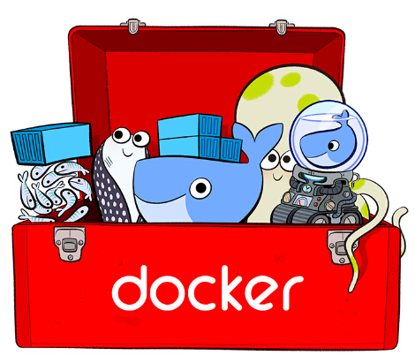
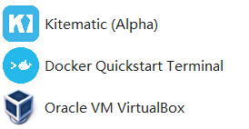
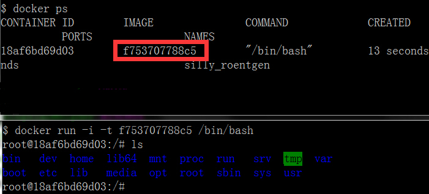
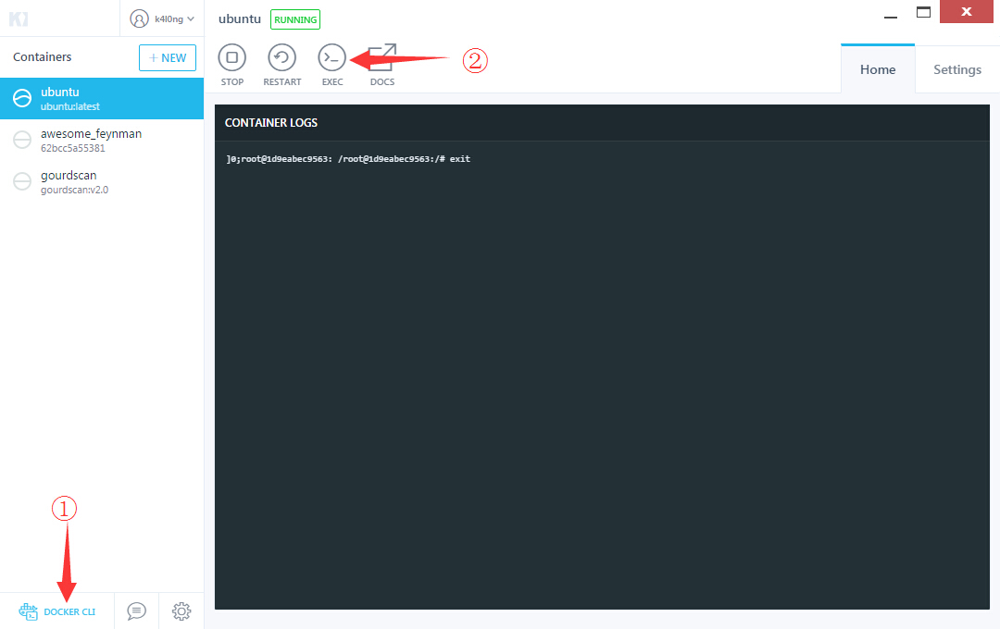

<h1 align="center">Docker学习记录</h1>

###- 什么是Docker?

Docker是一个开源的引擎，可以轻松的为`任何应用`创建一个轻量级的、可移植的、自给自足的容器。

更官方的解释自行百度谷歌或见官网：[http://www.docker.com](http://www.docker.com)

有个大牛说了个docker应用场景我感觉甚是贴切：假如今天是你入职第一天，领了机器之后你肯定会先一个一个安装应用环境，一天下来能把工作所需要的环境给配置好了就很不错了，可见这很是浪费时间而且还面临着应用兼容问题以及和同事的环境可能存在差异，在项目出来之后可能还会花很大精力去配置环境的问题，等等；我们这时候可以选择Docker，可以把它当做公司已经配好的虚拟机，直接拿来用就可以立刻工作起来，同事和你的环境都一样，也不必考虑兼容等等问题，不是很方便么。

但为啥不直接使用Ghost重装机器或者虚拟机嘞？呵呵~

知乎上有人回答说：Docker（码头工人）的思想来自于集装箱，集装箱解决了什么问题？在一艘大船上，可以把货物规整的摆放起来。并且各种各样的货物被集装箱标准化了，集装箱和集装箱之间不会互相影响。那么我就不需要专门运送水果的船和专门运送化学品的船了。只要这些货物在集装箱里封装的好好的，那我就可以用一艘大船把他们都运走。这里可以看docker的logo来理解，鲸鱼拖着许多集装箱。

这就解释了另外一个应用场景：应用的分离化，假如搭建一个Web网站需要CentOS+Apache+PHP+MySQL，我们即可利用CentOS的集装箱，Apache的集装箱和PHP，MySQL的集装箱来通信实现Web应用，集装箱之间除了交换数据并没有多余的联系。

###- 如何安装Docker？

####Windows：
1. 下载安装 Docker Toolbox（[https://www.docker.com/products/docker-toolbox](https://www.docker.com/products/docker-toolbox)）Toolbox内含Docker Quickstart Terminal，Kitematic，VirtualBox三个应用；

	

2. Docker Quickstart Terminal 可以理解为终端；
3. Kitematic Windows下的可视化终端，傻瓜式操作，但设置中不能设设置端口（BUG），需要在docker run就得设置上，具体往下看；
4. VirtualBox 虚拟机；

####Linux：
1. 直接运行即可：

	`sudo curl -fsSL https://get.docker.com/ | sh`

2. 适用于debian/ubuntu/centos等等；

###- 如何进行终端操作？

1. Windows下直接点开Docker Quickstart Terminal即可打开终端，界面如下：

	

2. Linux直接在终端下即可执行；
3. 后面步骤全在win下操作；

###- 镜像？容器？

我们可以把镜像理解为虚拟机的iso，容器是镜像的实例，先声明（描述）镜像，再创建容器，即同一个镜像容器可以有多个。

###- 准备开车 ( ゜- ゜)つロ 乾杯~

`场景`：假如你需要一台ubuntu系统的docker，在上面配置Web服务，使用Apache2+PHP+MySQL，如何配置如何运行如何打包如何停止...

`大体步骤`：pull（load/import）-run（exec）-commit-stop（restart）

1. 我们需要一个ubuntu镜像，这时候可以去从Docker Hub上搜索，直接pull下来；也可以那别人分享的直接来导入load或import（后面说）。

	`docker search ubuntu` 搜索ubuntu镜像；

	

	`docker pull ubuntu` 下载镜像；

2. 下载完成之后运行`docker images`查看镜像；

	

	可见127M的镜像文件；

3. 启动这个镜像，即创建它的容器；

	`docker run -i -t f753707788c5 /bin/bash`

	

	这里参数说明一下，-i -t直接得到一个交互shell；

	f753707788c5是镜像的IMAGE ID；

	/bin/bash 是使用shell脚本。

4. 以上可以看到，ubuntu已经以root权限运行起来了，这时候我们就可以在上面配置我们所需要的文件了：

	- 都知道第一步，更新源：`sed -i 's/archive.ubuntu.com/mirrors.ustc.edu.cn/g' /etc/apt/sources.list`
	- `apt-get update`，更新apt；
	- 由于下载的是精简版ubuntu，没有ipconfig等等命令，我们需要下载`apt-get install net-tools`；编辑器和路径补全TAB，`apt-get install vim bash-completion`；
	- 下载apache2，MySQL，PHP，不赘述了...

5. 这时候我们的docker算是整合完毕了，我们需要保存它；（如果没有保存而直接stop或者restart，那么配置会清零！）

	- 再打开一个终端（切记不能关交互的那个终端）；

	- `docker ps` 查看运行的容器；

		

	- `docker commit [CONTAINER ID] 名字:TAG` CONTAINER ID即18af6bd69d03；我这里输入如图：
	
		

	- 完成后，再次输入`docker images` 来查看镜像，你会发现多了一个叫 ubuntu，tag为2016.10.27的镜像，这样才能把你刚操作的更新保存。

		

	- commit 之后就可以把当前 Container 导出 Image 了：

		`docker export 18af6bd69d03 -o ubuntu` 执行完后，在你的个人目录下（/Users/你的用户名）可以找到 ubuntu 文件，这就是我们的最终目标：一个完成所有配置的 Image。

6. 至于关掉它，或者重启它，直接输命令即可；

	`docker stop <container id>` 停止该容器；

	`docker restart <container id>` 重启该容器；

	`<container id>`通过`docker ps` 来查看；

p.s.镜像，容器，分清楚~

----------

不是说还可以导入外部镜像文件么，看下面操作：

####load：
假如我们需要从外部拿到了一个ubuntu镜像文件，或者说我们直接拿上面生成的文件直接来用；这里需要注意镜像文件后缀有规定，.tar,.gz等等吧，具体百度。

1. `docker load -i ubuntu.tar`
2. 通过`docker images` 查看是否成功导入镜像；
3. 由于这里没有设置名字和TAG，显示为`<none> <none>`，利用`docker tag <IMAGE ID> 名字:TAG` 来设置；
4. 再次输入 `docker images` 会发现已经更改；

####import：
1. `cat ubuntu.tar | docker import - ubuntu:2016.10.27`
2. 这里直接就设置了，查看 `docker images` 会发现已经导入镜像文件；

###之后呢？
1. 有了镜像不和上面步骤一样了，由镜像创建容器等等；
2. 这里需要注意的是`docker run` 的参数，如果是后台运行，则使用`-d` 参数，进入容器后，需要调出shell界面，则执行`docker exec -i -t <container id> /bin/bash`；
3. 如果服务需要外网访问，这里需要做端口转发，`docker run -p 80:80 <IMAGE ID>`，即`-p`参数指定端口；
4. 如果想删除镜像或者容器呢？`docker rmi <image id>`删除镜像，使用`docker rmi <container id>` 删除容器；

### Windows下的Kitematic呢？

这是个GUI的界面化操作，缕过上面的过程后，这个几乎用不到，而且这个端口转发还有问题；

具体作用位置见下图：

①：相当于Docker Quickstart Terminal

②：进入容器的交互式shell

其他都很傻瓜，很好学；

还有一些命令，网上都有，直接百度吧。

###参考：

https://www.t00ls.net/thread-36440-1-1.html

https://www.t00ls.net/thread-36468-1-1.html

https://www.t00ls.net/thread-36467-1-1.html

http://numbbbbb.com/2016/09/26/20160926_用 Docker 快速配置前端开发环境
